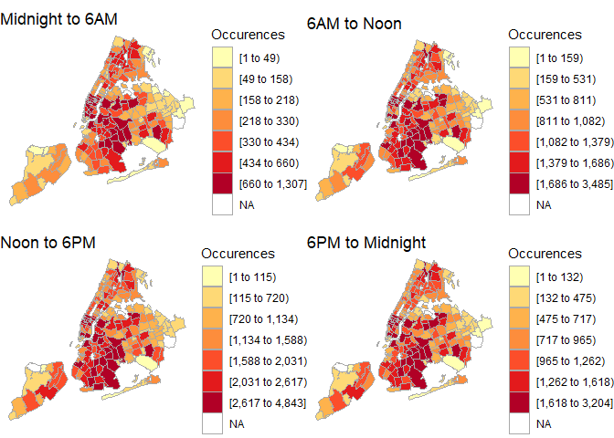

# Spatial_Analytics

This repository holds scripts to analyze many different phenomena (e.g. motor vehicle accidents in New York City, Nitrous Dioxide Pollution, and land usage information). The scripts in this repository are assignments and projects created for PLAN 590: Urban Analytics in R, a course taught by [Professor Kaza](http://sia.planning.unc.edu/#about) at UNC-Chapel Hill. 

## This Repository
This repository contains folders that should contain code and data that is ready to run in any machine equipped with R. Most output figures are included as well, although some mapping libraries in R do not transfer easily to Github (actively working to render clean Jupyter Notbeook-esque files).

### nitrous_dioxide_in_us
A look at the spread of NO2 and other pollutants across the US.

### traffic_accidents_in_nyc
An analysis of when and where traffic accidents are occuring in New York City.

### chicago_crime_final_project
For our final project, we looked at the relationship between Chicago's public transit system and the presence of crime. We used network analysis and spatial techniques to find a link between crime hotspots the location of the rail lines/transit centers.
